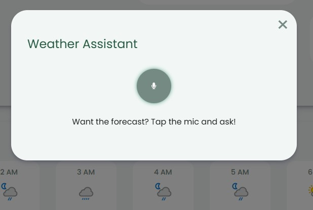
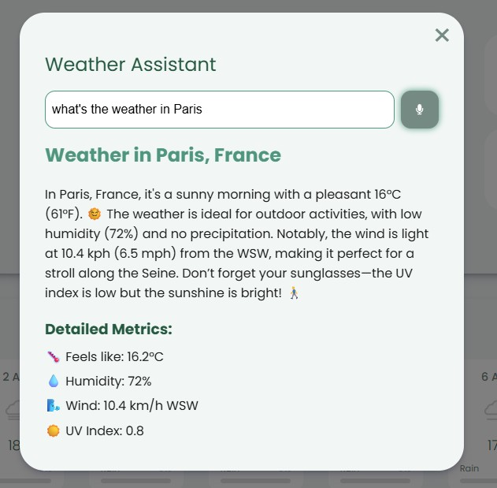
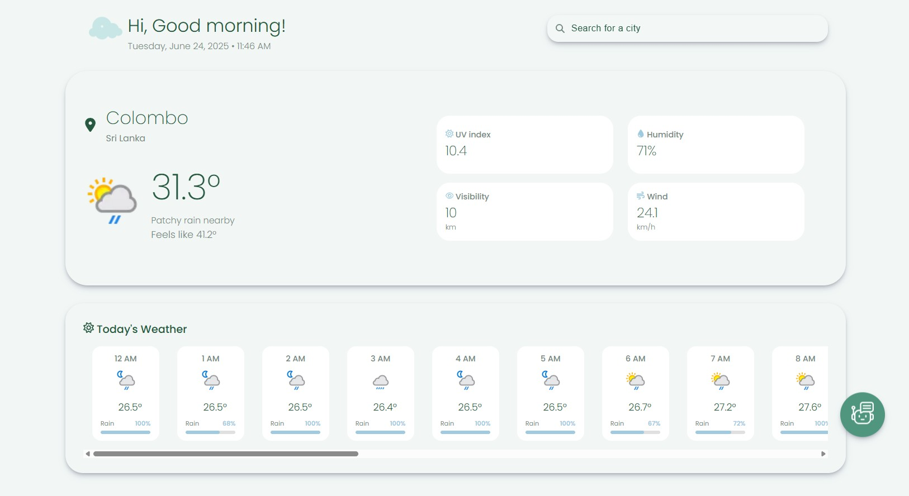
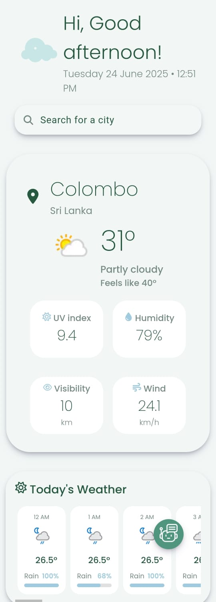
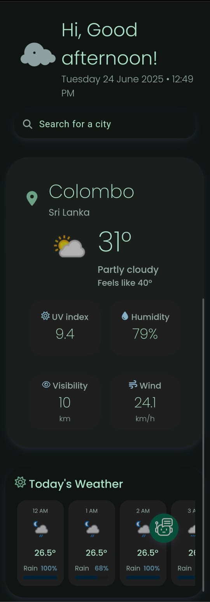

<p align="center">
  
</p>

<h2 align="center">SkyPulse – Intelligent Weather Companion</h2>


[Live Site](https://sky-pulse-roan.vercel.app/) • [Repository](https://github.com/harini-udeshika/weather-report)

SkyPulse is a sleek, responsive weather web app that delivers real-time weather updates, an hourly forecast, and a voice-powered weather assistant. Built with modern frontend technologies and designed with a focus on user experience, SkyPulse makes checking the weather a delight, whether you're on desktop or mobile.

---

## High-level System Architecture

<p align="center">
  
</p>


## ✨ Features

- 📍 **Local Weather on Load**  
  Uses **[ipapi.co](https://ipapi.co/)** to automatically fetch your approximate location and show current weather data.

- 🔍 **Smart Search with Suggestions**  
  Type any location to get the current weather and a same-day hourly forecast. Integrated with **Google Places API** for real-time search suggestions.
  
  

- 🎙️ **Voice-powered Weather Assistant**  
  Using **react-speech-recognition**, SkyPulse allows users to speak their desired location. A custom **MCP (Model Context Protocol)** developed with **DeepSeek** processes the spoken input, fetches weather data, and sends it back to DeepSeek to generate natural language weather insights.

<p align="left">



</p>

- 🧠 **Smart Greetings**  
  The app greets users based on the time of day (e.g., “Good Morning!”) and shows the current date and time below the greeting.

- 📱 **Mobile-Responsive Design**  
  Fully responsive layout ensures a smooth experience across mobile and desktop devices.

- ✅ **User Feedback & Error Handling**  
  - **Toasts** for successful weather loads and errors  
  - **Loading indicators** for slower data fetches

---

## ⚠️ Known Limitations

- 🗣️ **Speech Recognition Accuracy**  
  The voice assistant works best with well-known cities like *Paris*, *Colombo*, or *New York*. Recognition for lesser-known locations is limited and may require future improvements.

- ⛔ **IP Location Rate Limits**  
  **ipapi.co**’s free tier may hit rate limits, resulting in temporary `"Failed to fetch weather data"` errors.

---

## 🛠️ Tech Stack

- **Frontend:** React + Vite  
- **APIs:** ipapi.co,  weatherapi.com, Google Places, DeepSeek  
- **Voice Recognition:** react-speech-recognition  
- **Deployment:** Vercel  

---

## 🚀 Getting Started Locally

1. **Clone the repository**

   ```bash
   git clone https://github.com/harini-udeshika/weather-report
   cd weather-report
2. **Install dependencies**
   ```bash
   npm install
3. **Create a .env file in the project root and add:**
   ```bash
   VITE_WEATHER_API_KEY=your_openweather_api_key
   VITE_GOOGLE_PLACES_API_KEY=your_google_places_api_key
   VITE_DEEPSEEK_API_KEY=your_deepseek_api_key
4. **Run the development server**
   ```bash
   npm run dev
## 🖼️ UI Previews

### 💻 Desktop View




### 📱 Mobile View

<p align="left">
  
  
</p>


## 🎨 Design Details
### 🎨 Color Palette
- Soft Sage Greens

- Misty Blues
  -- Inspired by early morning natural light, the palette creates a calming and fresh look.

## 🔤 Typography
- Poppins – A clean, modern sans-serif font
  -- Emphasizes readability and elegance across all screen sizes.

## 🌀 Animations
- Smooth transitions on hover

- Subtle micro-interactions on button clicks

- Animated voice button while recording

## 📐 Layout
- Responsive grid layout with flexible spacing

- Intuitive card-based layout for weather blocks


